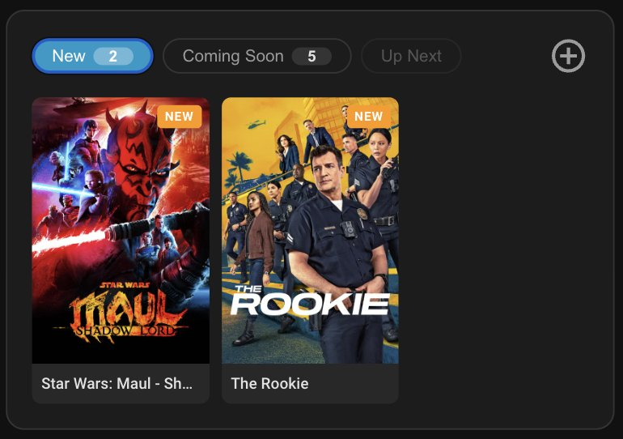

# PoLR TMDB

[](https://github.com/hacs/integration)
[](https://github.com/pathofleastresistor/polr-tmdb/releases)



A custom Home Assistant integration and Lovelace card for managing your household watchlist using [The Movie Database (TMDB)](https://www.themoviedb.org/).

## Features

- Track movies and TV shows with statuses: Want to Watch, Watching, Watched, Paused
- Suggestions with reasons, and a remembered "not for us" list
- Watch links that open a title in its streaming app on a Google TV
- TMDB artwork and metadata auto-fetched: posters, backdrops, title logos, episode stills, cast photos, ratings, genres, trailers, network info
- TV show progress tracking (current season + episode)
- New episode detection with badges
- Personal ratings (1–10) and notes
- One Lovelace card for everything: New / Coming Soon / Up Next / Suggested at a glance, with Search and Library opening as dialogs
- Real-time sync across all open dashboards via HA events
- HA services for automation integration

---

## Installation

### Via HACS (Custom Repository)

**Step 1 — Add the integration:**
1. In HACS, go to **Integrations → ⋮ → Custom Repositories**
2. Add `https://github.com/pathofleastresistor/polr-tmdb` with category **Integration**
3. Install **PoLR TMDB** and restart Home Assistant
4. Go to **Settings → Devices & Services → Add Integration**, search for **PoLR TMDB**
5. Enter your [TMDB API key](https://www.themoviedb.org/settings/api)

**Step 2 — Add the Lovelace card:**
1. In HACS, go to **Frontend → ⋮ → Custom Repositories**
2. Add `https://github.com/pathofleastresistor/polr-tmdb` with category **Plugin**
3. Install **PoLR TMDB** — the card resource is registered automatically

Then add the card to any dashboard:
```yaml
type: custom:polr-tmdb-card
```

---

## Adding Shows & Movies

Tap the 🔍 **Search** icon on the card and type a title:
- Tap **+** on a poster to add it to Up Next in one go
- Tap the poster itself for a preview (overview, genres, trailer, where to
  watch), then **Add to Up Next** or **Watching now**
- Titles already on your list show their status; tapping one opens it

Or via HA services. `polr_tmdb.search` finds the TMDB ID (and tells you if the
title is already on the list):
```yaml
service: polr_tmdb.search
data:
  query: Breaking Bad
  media_type: tv   # optional; searches movies and shows when left out
  limit: 5         # optional; defaults to 10
response_variable: found
```
Each result has `tmdb_id`, `media_type`, `title`, `year`, `overview`,
`rating`, `poster_url`, `backdrop_url`, and — for titles already on the list — `item_id` and
`status` (both `null` otherwise).

```yaml
service: polr_tmdb.add_to_watchlist
data:
  tmdb_id: 1396
  media_type: tv
  status: watching
```

---

## Lovelace Card

The card is the whole UI. At a glance it shows up to four sections:

| Section | Contents |
|---|---|
| **New** | TV shows with episodes aired beyond your current progress |
| **Coming Soon** | Episodes airing within the next 14 days |
| **Up Next** | Everything in your Want to Watch list |
| **Suggested** | Titles proposed with a reason, waiting for Add / Not for us |

Bigger tasks open as dialogs (full screen on phones), from the header icons:

| Dialog | What it's for |
|---|---|
| 🔍 **Search** | Find a movie or show on TMDB, preview it, and add it |
| 📚 **Library** | Your whole list, filtered by status (Watching, Watched, Paused, Not for us…) |
| **Details** | Opens from any poster: status, season/episode progress, rating, notes, where to watch |

Press **Esc** or tap outside a dialog to close it.

> **Upgrading from 1.2?** The *Shows & Movies* sidebar panel is gone — everything
> it did is in the card now. The sidebar entry disappears after a restart.

### Card options

```yaml
type: custom:polr-tmdb-card
title: Try Next
sections: [suggested, upnext]   # any of: new, soon, upnext, suggested
default_section: suggested
tvs:                            # Android TV Remote media players
  - entity: media_player.media_room_theater_room_tv
    name: Theater
search: false                   # hide the search button (shown by default)
```

With `tvs` set, anything that has a watch link gets **Open on** buttons that
open the title in its streaming app on that TV.

---

## Suggestions and watch links

Titles can be *suggested* with a reason (by a person or an automation). The card
shows them in a **Suggested** section with **Add** (moves it to Up Next) and
**Not for us** (dismisses it and records why). Dismissed titles are never
suggested again.

```yaml
service: polr_tmdb.suggest
data:
  tmdb_id: 136311
  media_type: tv
  reason: Warm ensemble comedy from the Ted Lasso team.
  source: Weekly suggester
  watch_link_url: https://tv.apple.com/us/show/shrinking/umc.cmc.apzybj6eqf6pzccd97kev7bs
  watch_link_service: Apple TV
```

Watch link formats confirmed on a Google TV Streamer (they open the show page;
the app resumes where you left off):

| Service | Link |
|---|---|
| HBO Max | `https://play.hbomax.com/show/<id>` |
| Apple TV | `https://tv.apple.com/us/show/<slug>/<umc.cmc id>` |
| Disney+ | `https://www.disneyplus.com/browse/entity-<id>` |
| Hulu (in Disney+) | `https://www.disneyplus.com/browse/entity-<id from the hulu.com/series link>` |

---

## Available Services

| Service | Description |
|---|---|
| `polr_tmdb.search` | Search TMDB by title; returns matches and whether each is on the list |
| `polr_tmdb.add_to_watchlist` | Add a movie or TV show by TMDB ID |
| `polr_tmdb.remove_from_watchlist` | Remove an item by item_id |
| `polr_tmdb.update_status` | Change watch status |
| `polr_tmdb.update_progress` | Update TV season/episode progress |
| `polr_tmdb.update_rating` | Set personal rating (1–10) |
| `polr_tmdb.suggest` | Suggest a title with a reason (safe to repeat) |
| `polr_tmdb.dismiss` | Pass on a title, with an optional reason |
| `polr_tmdb.set_watch_link` | Store the link that opens a title on a Google TV |
| `polr_tmdb.open_on_tv` | Open a title's watch link on an Android TV Remote media player |

---

## Sensor Entities

Each watchlist item creates a `sensor.polr_tmdb_*` entity:
- **State**: watch status (e.g. `watching`)
- **Attributes**: all metadata — poster, backdrop, genres, rating, overview, trailer URL, season/episode progress, new episode flag

---

## Local Development

```bash
git clone https://github.com/pathofleastresistor/polr-tmdb
cd polr-tmdb
npm install

# Configure local paths
cp .env.example .env
# Edit .env — set HA_CONFIG, HA_WWW, and HA_RESOURCES_FILE to match your setup

# Create the custom_components symlink and output JS directly to your HA www folder
npm run setup
npm run build

# Watch mode (rebuild on JS change)
npm run watch

# Restart HA after Python changes
docker restart homeassistant

# Install pre-commit hook (runs tests before every commit)
cp .git-hooks/pre-commit .git/hooks/pre-commit
chmod +x .git/hooks/pre-commit
```

## License

MIT — see [LICENSE](LICENSE).
